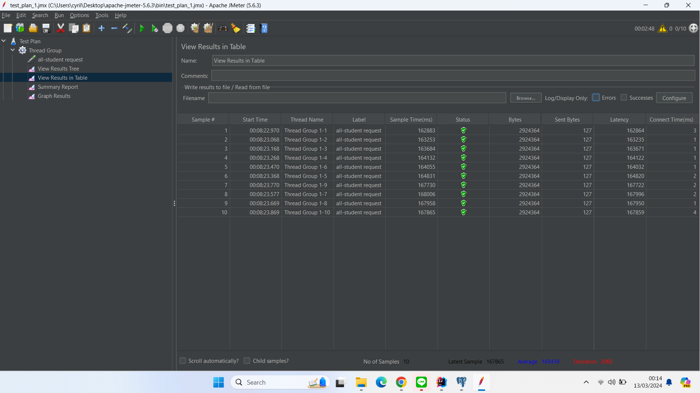
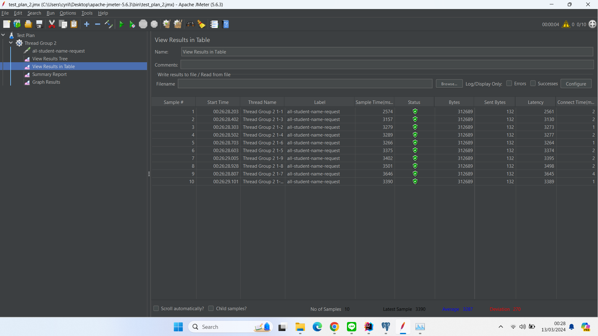
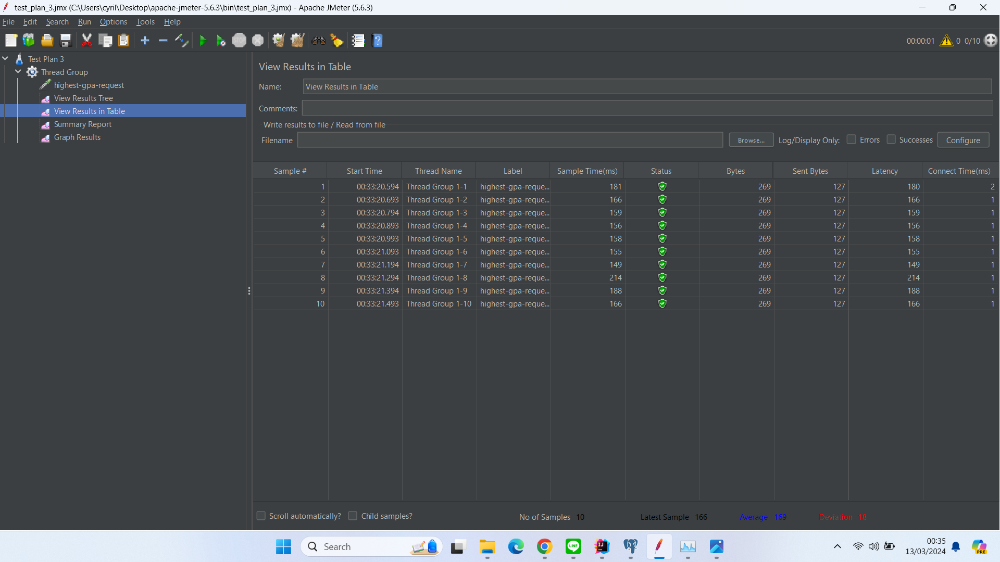
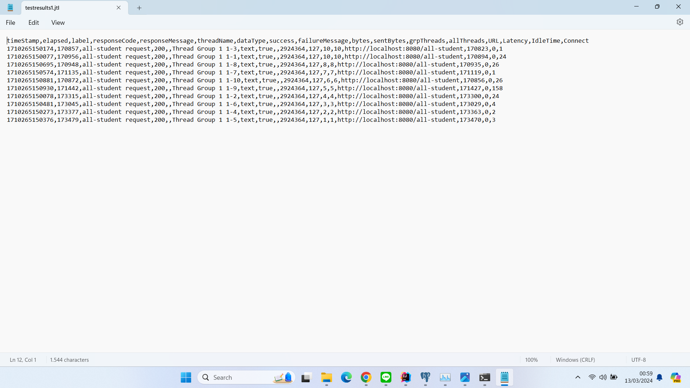
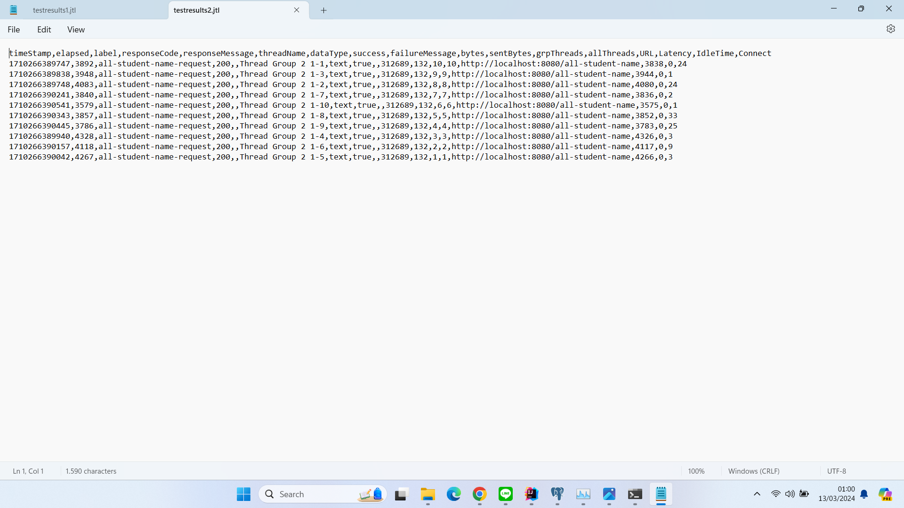
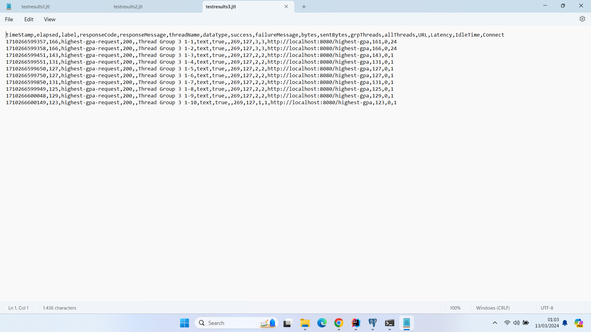
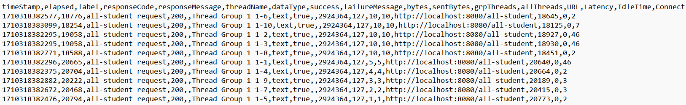
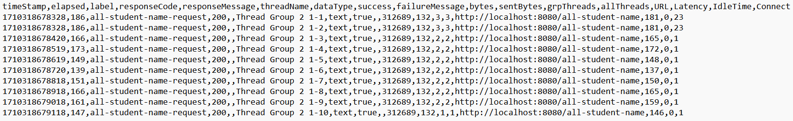
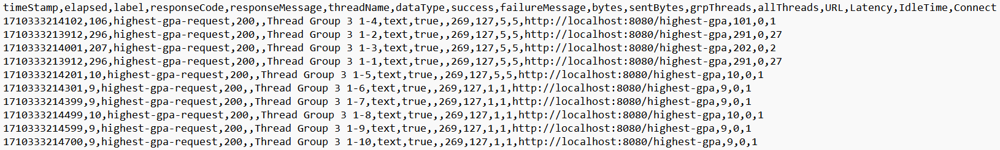

<h3>Hasil JMeter GUI sebelum optimasi</h3>

<h3>Hasil JMeter CLI sebelum optimasi</h3>

<h3>Hasil JMeter CLI setelah optimasi</h3>

Dari gambar perbandingan tersebut terlihat bahwa melakukan optimasi terhadap suatu bagian kode dapat mempengaruhi
performa keseluruhan dari aplikasi terutama jika yang kita optimasi adalah bagian kode yang menyebabkan bottleneck.
# Reflection

1. Perbedaan performance testing dengan menggunakan JMeter dan profiling menggunakan Intellij Profiler
adalah tipe testing yang dilakukan. JMeter berfungsi untuk mengetes keseluruhan aplikasi dengan kondisi
tertentu sementara Inteliij Profiler berfungsi untuk menganalisis waktu komputasi yang dibutuhkan suatu program
termasuk method-method yang digunakan saat program dieksekusi. Karena perbedaan ini JMeter biasanya digunakan
jika ingin mengetes program dengan skenario kejadian nyata sedangkan Inteliij Profiler biasanya digunakan saat
ingin melakukan refactor agar program lebih efisien

2. Profiling dapat membantu kita dalam mengidentifikasi kekurangan dalam program kita karena dengan melakukan
profiling kita bisa melihat CPU time, total time, dan memory allocations dari method yang kita gunakan. Hal ini
sangat berguna ketika kita ingin melakukan refactoring terhadap kode kita karena kita dapat mengetes bagian apa saja
yang harus direfactor dan kita juga bisa membandingkan performa program kita sebelum dan sesudah refactor

3. Ya, saya rasa IntelliJ Profiler sangat membantu saya dalam mengidentifikasi bottleneck pada program saya, kelebihan
Intellij Profiler yang menurut saya sangat membantu adalah keterangan CPU Time untuk setiap method yang dieksekusi sehingga
dapat membantu saya menganalisis efisiensi setiap method yang saya buat. Selain itu, Intellij Profiler bersifat built in pada IDE
Intellij sehingga mempermudah saya saat melakukan profiling, history profiling yang disediakan juga membantu saat akan melakukan perbandingan
efisiensi kode sebelum dan sesudah dilakukan refactor

4. Tantangan utama yang saya hadapi dalam melakukan performance testing dan profiling adalah untuk membiasakan diri dengan interface dari
Inteliij Profiler dan JMeter karena ini merupakan pertama kalinya saya melakukan performance testing dan profiling terhadap program yang
saya buat. Untuk tahapan refaktorisasi kode pada program ini saya tidak merasa terlalu kesulitan karena kompleksitas program yang masih cukup
simpel dan fitur recommendation yang disediakan Inteliij juga membantu saya saat merefaktor kode saya.

5. Benefit yang saya rasakan dari menggunakan Inteliij Profiler adalah kemudahan untuk melakukan profiling karena Inteliij Profiler
sudah tersedia pada IDE Inteliij, kelebihan lain yang saya rasakan adalah Inteliij Profiler memberikan history profiling yang telah kita lakukan
sehingga lebih mudah untuk membandingkan performa kode kita sebelum dan sesudah melakukan refactor. Inteliij Profiler juga memberikan informasi
yang berguna bagi saya seperti CPU Time dari suatu method dan memory allocation yang dapat membantu saya untuk mengidentifikasi bottleneck pada
program yang saya buat

6. Selama pengerjaan tugas ini saya tidak pernah mendapatkan hasil dimana hasil dari profiling yang saya lakukan tidak konsisten dengan hasil
performance testing yang dilakukan di JMeter namun menurut saya jika memang mendapatkan hasil yang tidak konsisten kita bisa melakukan tes ulang
baik pada JMeter ataupun Inteliij Profiler karena bisa saja perubahan yang kita lakukan belum terimplementasikan saat kita melakukan tes.

7. Cara yang saya lakukan adalah dengan mempelajari kode yang ada dan tujuan dari kode tersebut. Setelah saya paham tujuan dari kode tersebut barulah
saya mencari cara apakah dapat melakukan hal yang sama tetapi dengan kode yang lebih efisien. Selain itu saya juga membandingkan beberapa built in method yang
memiliki tujuan sama untuk melihat mana yang paling cepat. Cara yang saya lakukan untuk memastikan perubahan yang saya lakukan tidak berdampak pada fungsionalitas program
adalah dengan membandingkan output program sebelum dan sesudah dilakukan perubahan.